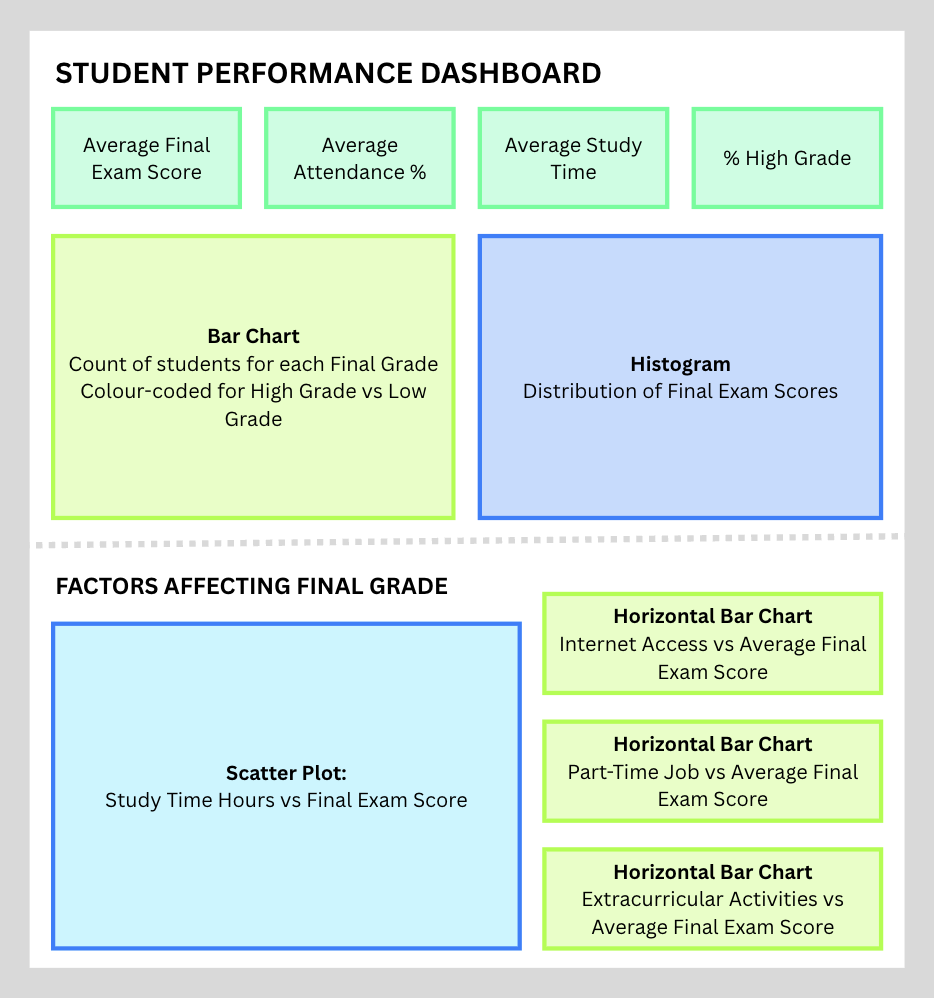

# STUDENT PERFORMANCE ANALYSIS

This project looks to analyse the academic performance of students and identify factors driving final exam results through statistical testing and predictive modelling.

# 

## Dataset Content

* The dataset I have chosen is [Student Performance & Study Habits Dataset](https://www.kaggle.com/datasets/harshadapatil31/student-performance-and-study-habits-dataset) - a public domain dataset sourced from Kaggle. 

* It is a **synthetic dataset** with information on 1,000 students, including their lifestyle, their study habits, demographic details and academic outcomes.

* The data does not represent real students.

* The data includes the following columns:

| **Column Name** | **Description** |
| --------------- | ---------------- |
| `student_id` | Unique student ID linked to an individual student |
| `gender` | Student’s gender |
| `study_time_hours` | The average daily study time of each student |
| `attendance_percent` | Class attendance percentage |
| `parental_education` | The highest education level of parent |
| `internet_access` | Whether a student has access to the internet |
| `extracurricular_activity` | Whether a student takes part in an extracurricular activity |
| `part_time_job` | Whether a student has a part-time job |
| `previous_grade` | Grade from previous term exam (0–100) |
| `final_exam_score` | Final exam score (0-100) |
| `final_grade` | Letter grade (A, B, C, D, F) |

* As you can see, there is a slight mismatch to be aware of in terms of the variable names: `previous_GRADE` refers to a score (0-100), whereas `final_GRADE` refers to a letter grade.This is just worth noting as you read through the project so as not to get confused.

## Business Requirements

* The business requirements for this project are to use statistical analysis and data visualisation to identify the key factors influencing students' final exam performance and grades. This will be explored in three Jupyter Notebooks and then I will create a dashboard in Tableau for non-technical stakeholders that gives an overview of student performance and identifies different factors affecting student performance. 

* The business requirements are as follows:

| **Business Requirement** | **Description** | **Linked Hypothesis** *(See below section for detail)* |
| ------ | ------- | --------- |
| **Prior Performance** | Understand whether a student's academic history is predictive of future performance, to help identify students who may benefit from early support based on previous grades | ***H1*** |
| **Part-Time Job Impact** | Determine whether students balancing part-time employment and their studies are likely to achieve lower scores, to inform guidance around workload management | ***H2*** |
| **Student Background** | Assess whether parental education levels are associated with academic outcomes, to understand whether additional support might be needed | ***H3*** |

## Hypotheses and how to validate?

* The hypotheses that will be examined are:

| **Hypothesis** | **Hypothesis Description** |
| ---- | -----|
| **H1** | Students with higher previous grades achieve higher final exam scores |
| **H2** | Students with a part-time job score lower in their final exam |
| **H3** | There is an association between parental education level and final grade |

* They will be validated as follows:

| **Hypothesis** | **How to Validate** |
| ---- | -----|
| **H1** | Tests for Normality: Shapiro-Wilk and Henze-Zirkler  Correlation Tests: Spearman and Pearson  Visualisation: Correlation plots for Spearman and Pearson |
| **H2** | Preliminary Descriptive Statistics: Mean and Median  Test for Normality: Shapiro-Wilk  Statistical Test: Mann-Whitney U |
| **H3** | Visualisation: Countplot  Statistical Test: Chi-Squared |

## Project Plan

* This project was divided into three separate sections: **Stage 1 - Anonymise**, **Stage 2 - ETL**, **Stage 3 - Visualisation**
    * **Stage 1 - ETL**: The ETL (Extraction, Transform, Load) process was completed on the raw student performance dataset. I cleaned categorical data, handled the 102 missing `parental_education` values and created then encoded a new `final_grade_category` feature to distinguish between low and high grades. A cleaned version of the dataset was saved to the folder `datasets/cleaned-data`.
    * **Stage 2 - Visualisation**: EDA (Exploratory Data Analysis) was performed to visualise categorical column data and to assess the relationship between `final_grade` and `final_exam_score`. Then, three hypotheses were analysed using statistical tests and data visualisation techniques, ultimately supporting or disproving them.
    * **Stage 3 - ML**: Three machine learning models were assessed to see how effective they were at predicting the target variable `final_exam_score`.

## Analysis techniques used

* **Stage 1 - ETL**
    * Descriptive Statistics: analysed the mean, median, standard deviation of numerical columns using `.describe()`.
    * Data Preparation: carried out categorical column cleaning.
    * Visualisation: performed a quick visualisation of numerical columns with seaborn boxplots and histoplots.
    * IQR Analysis: identified and handled outliers in numerical columns by investigating the interquartile ranges.
    * Feature Engineering: Extracted new feature columns, `final_grade_category` and `final_grade_category`.

* **Stage 2 - EDA and Visualisation**
    * Descriptive Statistics: analysed the mean and median of final exam scores by part-time jobs status.
    * Normal Distribution Testing: performed Shapiro-Wilk test and Henze-Zirkler test for bivariate normal (both with `pinguoin`).
    * Hypothesis Testing: carried out different statistical tests (Spearman and Pearson correlation tests, Mann-Whitney U test and Chi-Squared test) and assessed the appropriate coefficient (rho, r, RBC, Cramer's V) alongside the p-value to reject or uphold the null hypothesis in each case.
    * Visualisation: created a number of visualisation types to assist in exploratory data analysis and hypothesis testing:
        * countplot
        * pie chart
        * boxplot
        * heatmap
        * regplot
        * histogram

* **Stage 3 - ML**
    * Regression Models: trained and compared three regression models to see which was most effective in predicting the target variable `final_exam_score`.
        * Linear Regression: baseline model assuming a straight-line relationship between predictors and the final exam score target.
        * Decision Tree Regression: a non-linear model which captures threshold effects (where the effect suddenly kicks in) and interactions between features (when the effect of one variable depends on the value of another)
        * Random Forest Regression: a collection of Decision Trees 
    * Train Test Split: I split the dataset into training and test sets using `scikit-learn`.
    * Preprocessing: for each mode, I used `ColumnTransformer` to apply different preprocessing steps to different features
        * `OneHotEncoder` for categorical features
        * `StandardScaler` was used to standardise numerical features
    * Pipeline: combined the preprocessing step with one of the models in a pipeline, before fitting this pipeline to the training data
    * Evaluation: evaluated each model using four metrics (explained in more detail in **Stage 3 - ML**)
        * R²
        * MAE
        * MSE
        * RMSE
    * Visualisation: for linear regression, I plotted the predicted vs actual results on a scatter plot with a straight line to show the linear regression model. 

## Generative AI

* I very much wanted to solidify what I'd learned myself when completing this project, so treated AI as an "assistant" to support specific troubleshooting issues or processes I was unfamiliar with. Examples of when I did this are outlined in my project under *"Troubleshooting Issues"* and *"Notes on Process"*.

## Ethical considerations

* In our course, we have not yet learned about ethical considerations when working with data.
* Whilst there was a `student_id` in this dataset, I chose not to anonymise these numbers for two reasons:
    * The data was synthetic and did not represent real students
    * The `student_id` appeared to be more of an index, moving step-wise from 1 - 1,000.

## Dashboard Design

* In my dashboard, I wanted to create a simple dashboard that communicated information to non-technical stakeholders.
* I wanted three main sections:
    1. KPI cards with high level student performance data
    2. A bar chart and histogram to give viewers the ability to explore the students' performance
    3. A section covering four separate lifestyle and background factors and how they affected students' final grades.
* I plotted this out in a dashboard wireframe:

## Dashboard Deployment

* The link to the dashboard created can be found here: [Student Performance Dashboard](https://public.tableau.com/views/student-performance-analysis/Dashboard1)

## Unfixed Bugs

* In the three Jupyter Notebooks, I have found that sometimes the visualisations don't show up if you click *Run All*. If this happens, please manually run the cell again and the plots should appear.

## Development Roadmap

* An unknown challenge I faced that I had not seen before was the appearance in my git of two untracked changes `.DS_Store` and `datasets/.DS_Store`. These came up on the last day of my project and had not appeared previously. The way I handled this was to include them in my `.gitignore` file, a suggestion I found in an article on [Medium](https://medium.com/@gmlearnshealth/day-42-how-i-solved-the-mystery-of-ds-store-in-my-git-repository-b06091936115). Whereas the author of the article had already been tracking `.DS_Store` and it continued to appear even after putting it in `.gitignore`, I was glad that I appeared to have caught it in its first appearance so it disappeared from my git status. I hope this has now not been uploaded to my repository and that I dealt with this appropriately.

* I want to continue to develop skills in machine learning, particularly with regards to refining a pipeline to be better at feature selection etc. I also want to get better at understanding how to show what features have been most important when a model has been fit.

* With regards to data visualisation, I would like to get more confident in looping over variables to create multiple graphs, rather than spelling out each one individually as I have done above.

## Main Data Analysis Libraries

* pandas
* numpy
* matplotlib
    * .pyplot
* seaborn
* pingouin
* scipy
* sklearn
    * .pipeline - Pipeline
    * .compose - ColumnTransformer
    * .preprocessing - OneHotEncoder, StandardScaler
    * .linear_model - LinearRegression
    * .tree - DecisionTreeRegressor
    * .ensemble - RandomForestRegressor
    * .metrics - r2_score, mean_squared_error, mean_absolute_error
* os

## Credits

* In all sections, I have included Markdown cells entitled *Troubleshooting Issues* and *Notes on Process*: in cases where I have used blogposts/ articles, official documentation or generative AI to support me in troubleshooting issues or in assisting me to complete a process I might not have seen before, I have also included references to this within the notebooks themselves in these cells.

### Stage 1 - ETL
* The write-up of **Core Statistical Concepts** came from learnings taken from the LMS.
* Credit to Rory from Code Institute for the **D-I-S-H** acronym and for taking us through a step-by-step process for ETL, particularly with regards to IQR analysis for handling outliers.

### Stage 2 - Visualisation
* Basic reminder: this [Stack Overflow comments section](https://stackoverflow.com/questions/34682828/extracting-specific-selected-columns-to-new-dataframe-as-a-copy) on how to create a new dataframe from an existing one.
* Understanding the difference between Spearman and Pearson correlation tests: [Pearson vs Spearman Correlation: Find Harmony between the Variables](https://towardsdatascience.com/pearson-vs-spearman-correlation-find-harmony-between-the-variables-08e201ca9f7f/)
* This set of three articles on Medium about Pearson correlation:
    * [Part 1: Methodology](https://medium.com/@anthony.demeusy/pearson-correlation-methodology-limitations-alternatives-part-1-methodology-42abe8f1ba90)
    * [Part 2: Limitations](https://medium.com/@anthony.demeusy/pearson-correlation-methodology-limitations-alternatives-part-2-limitations-63c20b21e53b)
    * [Part 3: Alternatives](https://medium.com/@anthony.demeusy/pearson-correlation-methodology-limitations-alternatives-part-3-alternatives-cc2a56f7ad1f)
* Times I have used Generative AI have been documented in the notebook. Two particularly useful instances were:
    * Claude Sonnet 5 was able to recommend a statistical test - Henze-Zirkler - for testing bivariate normality.
    * It also showed me the `.get_group()` method, which I had not seen previously.

### Stage 3 - ML
* In this section, I predominantly used the Code Institute LMS content, and must give particular credit to the instructions on how to create a pipeline with a custom method that combined the preprocessing steps and the pipeline itself. As I wrote in my *Notes on Process*, I had originally planned to do all the steps separately but I found it much harder to follow and thus more prone to errors.
* Additionally, I used Generative AI (Claude Sonnet 5), to provide me with a simplified breakdown of all the steps in a machine learning pipeline to help my understanding. One of the additional tools I was able to learn about was `ColumnTransformer`.

### Dashboard
* In order to complete my dashboard, I found a very informative channel on Youtube called "OneNumber - Tableau Experts" that helped me greatly:
    * This video on [How to Build KPI Tiles in Tableau](https://www.youtube.com/watch?v=YceBSqUuPOU)
    * This video on [How to Build Histograms in Tableau](https://www.youtube.com/watch?v=H1K9A_Y44t0), which also provided guidance on how to create a dynamic slider to alter bin size in my histogram.

### Media
* The image used in this README.md is from Code Institute

## Acknowledgements

* Thank you to everyone from the Code Institute team who have been instrumental in my learning up to this point.
* Thanks to my great cohort!